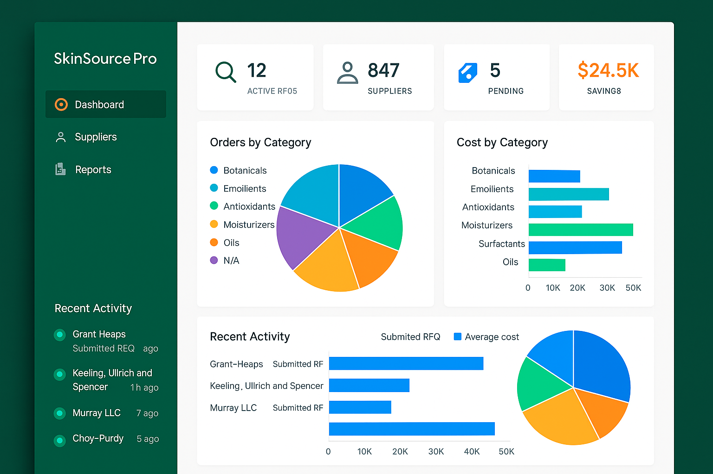

# SkinSource Pro - Intelligent Procurement Platform



**Part of the SkinTwin AI Ecosystem**

An advanced intelligent procurement platform specifically designed for the skincare and cosmetics industry. SkinSource Pro enables manufacturers and formulators to efficiently source raw materials and ingredients through AI-powered supplier intelligence, automated discovery, and sophisticated procurement workflows.

## 🌐 Live Application

**Permanent Deployment:** [https://9yhyi3czmgnv.manus.space](https://9yhyi3czmgnv.manus.space)

## 🎯 Overview

SkinSource Pro revolutionizes ingredient procurement in the skincare industry by providing:

- **Intelligent Supplier Discovery**: Automated identification of qualified suppliers based on ingredient requirements
- **Comprehensive Market Intelligence**: Real-time market trends, price forecasting, and competitive analysis
- **Advanced Procurement Workflows**: Streamlined RFQ processes with automated supplier evaluation
- **Regulatory Compliance**: Built-in regulatory status tracking for FDA, EU, and COSMOS standards
- **Sustainability Focus**: Supplier sustainability scoring and eco-friendly sourcing options

## 🏗️ Architecture

### Technology Stack

**Frontend:**
- React 18 with Vite
- Tailwind CSS
- shadcn/ui components
- Lucide icons

**Backend:**
- Flask (Python)
- SQLAlchemy ORM
- SQLite/PostgreSQL
- RESTful API

**Intelligence Engine:**
- Custom supplier intelligence service
- Market analysis algorithms
- Price optimization engine
- Automated supplier discovery

## 📁 Project Structure

```
skinsource-pro/
├── backend/
│   ├── src/
│   │   ├── models/          # Database models
│   │   ├── routes/          # API endpoints
│   │   ├── services/        # Business logic & intelligence
│   │   ├── static/          # Built frontend assets
│   │   ├── main.py          # Flask application entry
│   │   └── seed_data.py     # Database seeding
│   └── requirements.txt     # Python dependencies
├── frontend/
│   ├── src/
│   │   ├── components/      # React components
│   │   └── App.jsx          # Main application
│   └── index.html           # HTML entry point
├── docs/
│   ├── SkinSource_Pro_Documentation.md
│   ├── API_Reference_Guide.md
│   ├── app_design.md
│   └── research_findings.md
├── assets/
│   ├── skinsource_dashboard.png
│   ├── ingredient_search.png
│   └── supplier_dashboard.png
└── README.md
```

## 🚀 Quick Start

### Backend Setup

```bash
cd backend
python -m venv venv
source venv/bin/activate  # On Windows: venv\Scripts\activate
pip install -r requirements.txt

# Initialize database
python src/main.py
```

### Frontend Setup

```bash
cd frontend
npm install
npm run dev  # Development server
npm run build  # Production build
```

### Database Initialization

```bash
# Seed sample data
python src/seed_data.py
python src/services/seed_intelligence_data.py
```

## 🔑 Core Features

### 1. Dashboard & Analytics
- Real-time procurement metrics and KPIs
- Cost analysis by ingredient category
- Recent activity tracking
- Supplier performance summaries

### 2. Ingredient Catalog
- Comprehensive database of skincare ingredients
- Advanced search and filtering
- Regulatory status tracking (FDA, EU, COSMOS)
- Evidence-based efficacy ratings
- Sustainability scoring

### 3. Supplier Network Management
- Global supplier database with detailed profiles
- Multi-dimensional supplier scoring:
  - Quality (certifications, track record)
  - Reliability (delivery performance)
  - Sustainability (environmental practices)
  - Price Competitiveness
- Geographic coverage tracking

### 4. Intelligent Procurement Workflow
- RFQ creation and management
- Automated supplier matching
- Bid comparison and analysis
- Approval workflows
- Performance tracking

### 5. Supplier Intelligence Engine
- **Automated Discovery**: Multi-source supplier identification
- **Performance Evaluation**: Comprehensive scoring algorithms
- **Price Optimization**: Cross-supplier pricing analysis
- **Market Intelligence**: Trend analysis and forecasting
- **Competitive Analysis**: Multi-supplier comparison tools

## 📊 API Endpoints

**Base URL:** `https://9yhyi3czmgnv.manus.space/api`

### Ingredients
- `GET /ingredients` - Retrieve ingredient catalog
- `GET /ingredients/{id}` - Get ingredient details

### Suppliers
- `GET /suppliers` - Retrieve supplier directory
- `GET /suppliers/{id}` - Get supplier profile

### Procurement
- `GET /procurement/requests` - List procurement requests
- `POST /procurement/requests` - Create new request
- `GET /procurement/dashboard` - Dashboard statistics

### Intelligence
- `POST /intelligence/discover-suppliers` - Automated supplier discovery
- `GET /intelligence/market-intelligence/{category}` - Market insights
- `POST /intelligence/optimize-pricing` - Price optimization
- `POST /intelligence/competitive-analysis` - Supplier comparison

## 📖 Documentation

Comprehensive documentation is available in the `docs/` directory:

- **[Project Documentation](docs/SkinSource_Pro_Documentation.md)**: Complete technical and business overview
- **[API Reference Guide](docs/API_Reference_Guide.md)**: Detailed endpoint documentation
- **[App Design](docs/app_design.md)**: UI/UX design specifications
- **[Research Findings](docs/research_findings.md)**: Industry analysis and requirements

## 🌟 Key Benefits

- **40% reduction** in procurement cycle time
- **Enhanced supplier performance** through data-driven selection
- **Cost optimization** through intelligent price analysis
- **Improved regulatory compliance** through automated tracking
- **Better sustainability outcomes** through supplier scoring

## 🔗 Integration with SkinTwin AI Ecosystem

SkinSource Pro is designed to integrate seamlessly with other components of the SkinTwin AI ecosystem:

- **SkinTwin Cognitive Alchemist Workbench**: Central nervous system for beauty-tech integration
- **AI Skin Analysis**: Integration with diagnostic and analysis features
- **Virtual Beauty Agents**: Support for automated consultation and recommendations
- **Supply Chain Intelligence**: Real-time tracking and optimization

## 🛠️ Development

### Environment Variables

```bash
FLASK_ENV=development
DATABASE_URL=sqlite:///skinsource.db
SECRET_KEY=your-secret-key
CORS_ORIGINS=*
```

### Running Tests

```bash
# Backend tests
cd backend
python -m pytest

# Frontend tests
cd frontend
npm test
```

## 📈 Future Roadmap

### Phase 1 (Next 3 months)
- Advanced reporting and analytics dashboard
- Email notifications and alerts
- Mobile application development
- Enhanced search capabilities

### Phase 2 (3-6 months)
- Machine learning price prediction
- Automated contract management
- Integration with major ERP systems
- Multi-language support

### Phase 3 (6-12 months)
- Blockchain supply chain tracking
- AI-powered supplier recommendations
- Advanced risk assessment tools
- Global regulatory database expansion

## 🤝 Contributing

This project is part of the SkinTwin AI ecosystem. For contributions or integration inquiries, please refer to the main SkinTwin documentation.

## 📄 License

Part of the SkinTwin AI Ecosystem. All rights reserved.

## 🙏 Acknowledgments

Developed as part of the revolutionary AI-driven beauty-tech ecosystem initiative, combining cutting-edge technology with industry expertise to transform skincare ingredient procurement.

---

**Project Status:** ✅ Production Ready  
**Deployment:** Permanent at https://9yhyi3czmgnv.manus.space  
**Last Updated:** January 17, 2026  
**Version:** 1.0.0
